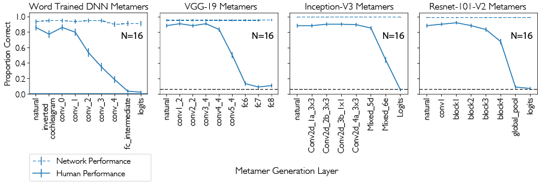

## 🚨🚨🚨Update (2023)🚨🚨🚨
We published a journal paper building significantly on this work: <br> ["Model metamers reveal divergent invariances between biological and artificial neural networks." Feather et al. 2023. Nature Neuroscience 2023.](https://www.nature.com/articles/s41593-023-01442-0)

There is an associated repository to generate model metamers in PyTorch here: <br>
https://github.com/jenellefeather/model_metamers_pytorch

This repository is no longer actively maintained. Please use the above repository instead.  

# Metamers of neural networks reveal divergence from human perceptual systems
This repository includes code, data, and demos for the paper ["Metamers of neural networks reveal divergence from human perceptual systems."](https://papers.nips.cc/paper/9198-metamers-of-neural-networks-reveal-divergence-from-human-perceptual-systems)

In this work, we investigated whether the invariances learned by deep neural networks actually match human perceptual invariances. We found sets of stimuli that the network said were the same and asked if humans also perceive these stimuli as the same. We call these stimuli “model metamers” --  stimuli that are physically distinct but that are perceived to be the same by a model. 

The provided code includes demonstrations of generating "Model Metamers" from example audio-trained and image-trained networks, and checks the optimization sucesss.




## Additional Links
Poster: http://mcdermottlab.mit.edu/jfeather/model_metamers/neurips2019_metamers_poster.pdf

Audio Demos: http://mcdermottlab.mit.edu/jfeather/model_metamers/audio_metamers.html

## Jupyter Notebook examples

The metamer generation is outlined in two jupyter notebooks: 

(1) [VGG19_Metamers_Using_TFSlim_Model.ipynb](VGG19_Metamers_Using_TFSlim_Model.ipynb) : Generates model metamers for the VGG-19 network downloaded from tfslim. The proceedure used for optimization is very similar to other image network inversion techniques, but does not apply regularizations such as a tv loss as these hide potential model differences. 

(2) [Audio_Network_Metamers.ipynb](Audio_Network_Metamers.ipynb) : Generates model metamers for two networks trained to recognize words in noise. Requires the tfcochleagram package, as the audio metamers are generated by optimizing the raw waveform. Otherwise similar to the image metamer generation. 


## Things to install
Python packages used in the code: 
```
tensorflow (1.13)
numpy (1.16.1)
matplotlib (3.0.2)
scipy (1.2.1)
resampy (0.2.1)
```
Upon request a singularity image can be provided for reproducibility. 

### Image network downloads
Get the vgg.py network from the tfslim model repo, download full repo here: 
https://github.com/tensorflow/models/tree/master/research/slim

Specifically, we need the vgg.py model, located here: 
https://github.com/tensorflow/models/blob/master/research/slim/nets/vgg.py

The VGG-19 model is used in this demo. Download the checkpoint from here:
http://download.tensorflow.org/models/vgg_19_2016_08_28.tar.gz

Untar the above file (`tar -xvf vgg_19_2016_08_28.tar.gz`) and you should have a file called `vgg_19.ckpt`.

#### Download a pre-computed null distribution of activations for VGG-19. 
The null for this model is downloadable from:
`http://mcdermottlab.mit.edu/jfeather/model_metamers/assets/vgg_null_dist_spearman_r.pckl`


### Audio network downloads

#### Download tfcochleagram and pycochleagram
To generate audio metamers you will need tfcochleagram to build a tensorflow graph for the cochleagram generation (located in a separate github repo) which will also require pycochleagram to generate the cochlear filters:

https://github.com/jenellefeather/tfcochleagram

https://github.com/mcdermottLab/pycochleagram

#### Download the audio model checkpoint, null distribution, and configuration pickle

http://mcdermottlab.mit.edu/jfeather/model_metamers/assets/metamers_audio_models_network_files.tar.gz

(Warning: This file is ~2GB in size)

Untar the above file (`tar -xvf metamers_audio_models_network_files.tar.gz`). 

This file should contain the following: 

(1) Network configuration files used by the `build_*.py` scripts (`word_network_aliased.pckl`, `word_network_reduced_aliasing.pckl`)

(2) Saved tensorflow checkpoints for both models

(3) Pre-computed null distributions for both models (`word_aliased_null_dist_spearman_r.pckl`, `word_reduced_aliasing_null_dist_spearman_r.pckl`)

## Citation
If you use this code, please cite the following paper: 

```
@inproceedings{feather2019metamers,
  title={Metamers of neural networks reveal divergence from human perceptual systems},
  author={Feather, Jenelle and Durango, Alex and Gonzalez, Ray and McDermott, Josh},
  booktitle={Advances in Neural Information Processing Systems},
  pages={10078--10089},
  year={2019}
}
```

## Authors

* **Jenelle Feather** (https://github.com/jenellefeather)
* **Alex Durango**
* **Ray Gonzalez**
* **Josh McDermott** (https://github.com/mcdermottlab)

## License

This project is licensed under the MIT License - see the [LICENSE.md](LICENSE.md) file for details

